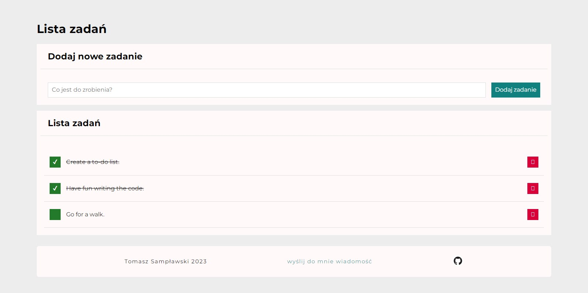

# To-do list
This is a simple task list management application that allows you to add, remove, and mark tasks as completed.

You can try the application at this [link](https://samplawski.github.io/simple-to-do-list/).

## Table of Contents

1. Short Description
2. Features
3. Technologies Used
4. Installation
5. How to Use
6. Status and Contributions
7. Contact

## 1. Short Description
Task List is a simple task list application built using HTML, CSS, and JavaScript. The application allows users to add tasks to a list, remove tasks, and mark tasks as completed.

## 2. Features

- Add tasks to the list
- Remove tasks from the list
- Mark tasks as completed
- Intuitive user interface
- Responsive design that works on desktop and mobile devices
- Links in the footer to:
  - GitHub repository of the project
  - Contact the creator via email

## 3. Technologies Used

The application was built using the following technologies:
- HTML
- CSS
- JavaScript

The HTML structure consists of a form for adding new tasks, a tasks list container for displaying tasks, and a heading for the list of tasks. The form has an input field for typing task content and a "Dodaj zadanie" (Add Task) button for submitting the form.

The JavaScript code handles the functionality of the to-do list. It includes functions for adding new tasks, removing tasks, and toggling the "done" status of tasks. Event listeners are used to capture user actions, such as form submission, button clicks, and task removal.

The CSS code is used for styling the web application. It includes styles for the form, tasks list, buttons, and other elements. The CSS uses the Montserrat font from Google Fonts and the Normalize CSS library for cross-browser consistency.

## 4. Installation

To run the application locally, follow these steps:

- Clone the repository to your local device using the command git clone https://github.com/samplawski/task-list.git
- Navigate to the project directory using the command cd task-list
- Open the index.html file in your web browser

## 5. How to Use
1. Visit the Task List application website.
2. Add tasks to the list using the input field and the "Dodaj zadanie" (Add Task) button.
3. Tasks will be displayed on the tasks list.
4. To mark a task as completed, click on the green checkbox next to the task.
5. To remove a task from the list, click on the red "Bin" button next to the task.

## 6. Status and Contributions
The project was created by Tomasz Sampławski and is currently completed, but may be updated in the future. Contributions are welcome and appreciated! You can use it in your own projects or customize it to your needs.

## 7. Contact
If you wish to contact me, you can email me at tsamplawski@gmail.com.
